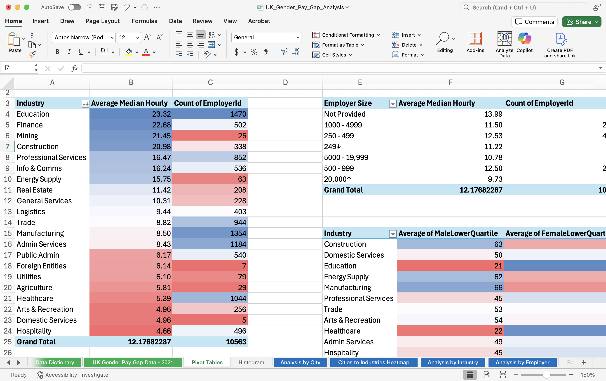
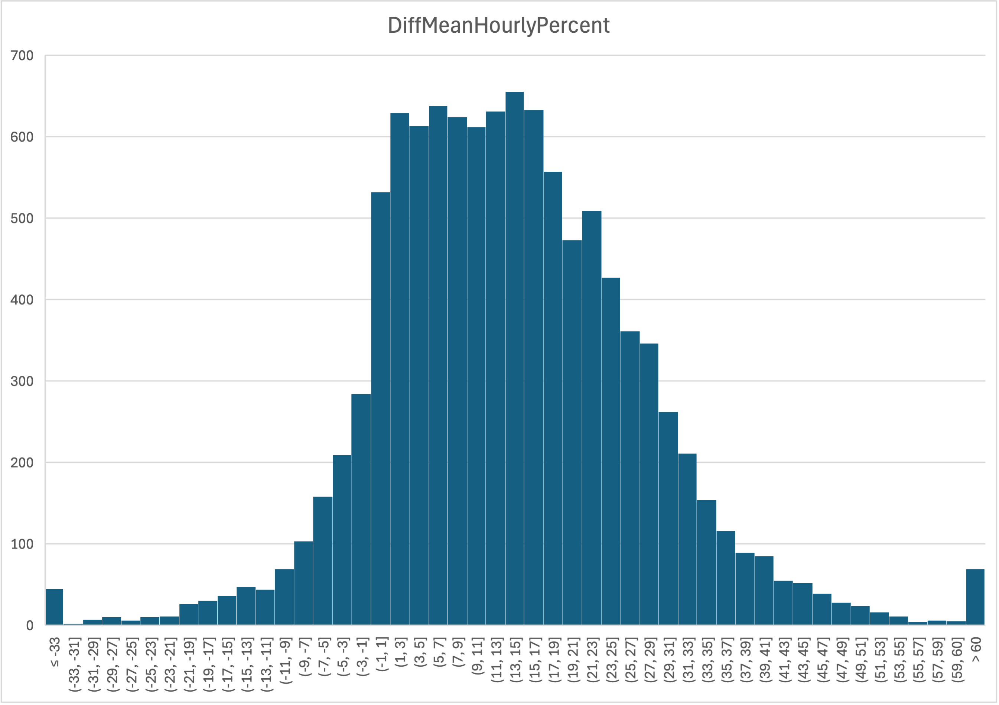
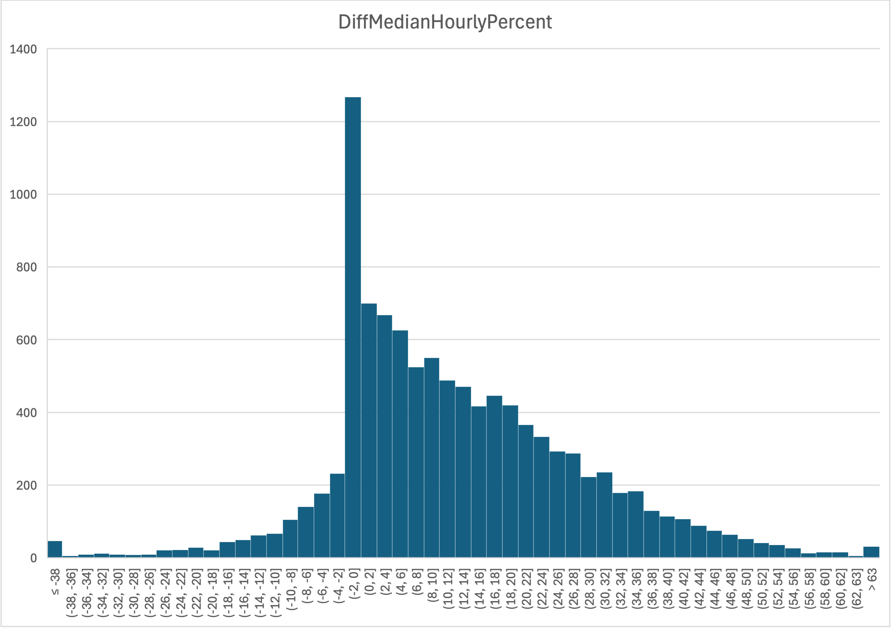
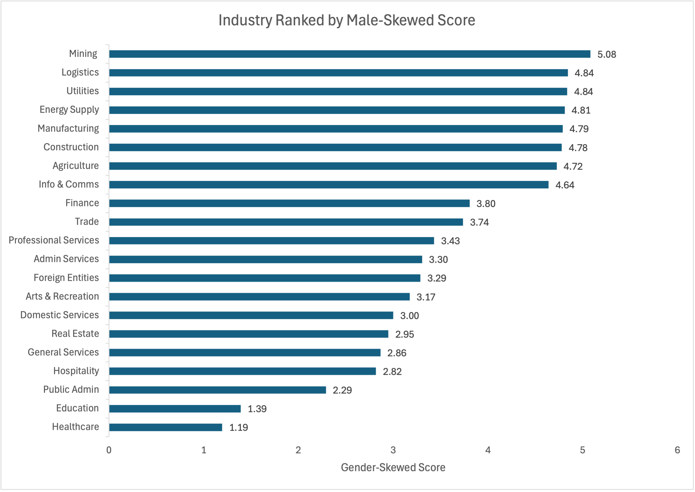
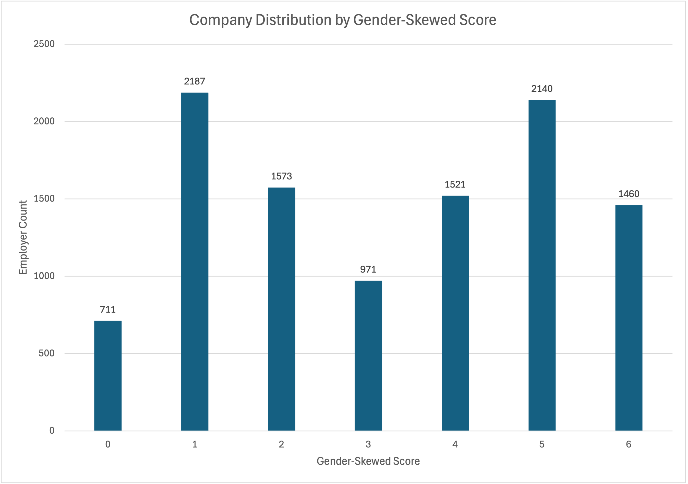
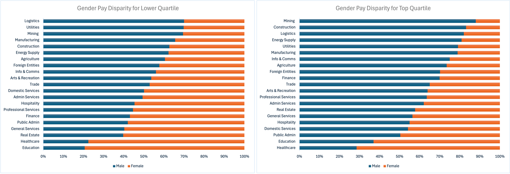

# UK Gender Pay Gap Analysis

### Exploring disparity from macro to micro level using real-world company data.

---

## Problem Statement
The gender pay gap is the average difference in earnings between men and women across an organisation.

Despite decades of attention, it remains a persistent issue, impacting not only workplace fairness but also economic productivity and systemic equality.

This project uses UK Companies House dataset from 2021 to explore whether pay disparities arise from macro-level patterns (like city or industry) or micro-level company factors — and what insights we can derive to inform a fairer system.

---

## Table of Contents
1. [Challenge Objective](#1-challenge-objective)  
2. [Tools Used](#2-tools-used)  
3. [End-to-End Workflow](#3-end-to-end-workflow)  
   - [EDA with SQL](#31-eda-with-sql)  
   - [Data Preparation](#32-data-preparation)  
   - [Analysis with Excel](#33-analysis-with-excel)  
4. [Key Findings](#4-key-findings)  
5. [Recommendations](#5-recommendations)  
6. [Room for Improvement](#6-room-for-improvement)  
7. Documentation
   - 📁 [Dataset](./dataset/)  
   - 📊 [Excel Worksheets](./excel/)  
   - 🐍 [API Script](./python/)  
   - 🖼️ [Presentation Deck](https://drive.google.com/file/d/13VSyUH45xS_WGP0b79TjwEgrxgxqaOe6/view?usp=share_link)

---

## 1. Challenge Objective
I challenged myself to use fundamental tools only (SQL, Excel) to conduct in-depth data analysis without relying on advanced packages or machine learning. This compelled me to concentrate on the essential components of any effective analytical work:  
• Data quality  
• Business logic  
• EDA  
• Insight storytelling

---

## 2. Tools Used

| Tool           | Purpose |
|----------------|---------|
| **SQL**        | Exploratory analysis, missing value checks, aggregation queries |
| **Python**     | Used with Companies House API to retrieve missing SIC codes |
| **Excel**      | Cleaning, transforming, pivot tables, and visualisation |
| **PowerPoint** | Presenting final charts and findings |
| **GitHub**     | Version control and documentation |

---

## 3. End-to-End Workflow

### 3.1 EDA with SQL

### Q1 Check for Missing Data
Before choosing which pay gap features to use in analysis, I examined how complete the data was. I used SQL to calculate the percentage of missing values. Below is the base structure of the query.

```sql
SELECT 'DiffMeanHourlyPercent' AS Measure,
       COUNT(*) AS TotalRecords,
       SUM(CASE WHEN DiffMeanHourlyPercent = 0 THEN 1 ELSE 0 END) AS MissingCount,
       ROUND(SUM(CASE WHEN DiffMeanHourlyPercent = 0 THEN 1 ELSE 0 END) * 100.0 / COUNT(*), 2) AS MissingPercentage
FROM gender_pay_gap_21_22
UNION ALL
SELECT 'DiffMedianHourlyPercent' AS Measure, 
        COUNT(*) AS TotalRecords,
        SUM(CASE WHEN DiffMedianHourlyPercent = 0 THEN 1 ELSE 0 END) AS MissingCount,
        ROUND(SUM(CASE WHEN DiffMedianHourlyPercent = 0 THEN 1 ELSE 0 END) * 100.0 / COUNT(*), 2) AS MissingPercentage
FROM gender_pay_gap_21_22;
```
| Measure                | Total Records | Missing Count | Missing Percentage |
|------------------------|---------------|---------------|--------------------|
| DiffMeanBonusPercent   | 10174         | 2837          | 27.88              |
| DiffMedianBonusPercent | 10174         | 4019          | 39.50              |

**Takeaway:**
Fields related to bonuses had over 20% missing data, making them unsuitable for analysis. However, I chose not to drop rows with "0" values, as these could indicate real situations such as no bonus, gender parity, or input errors.

### Q2 Choosing the Right Metric: Mean vs Median
To determine the appropriate unit of measure, I calculated the average of DiffMeanHourlyPercent and DiffMedianHourlyPercent to evaluate their significance.

```sql
SELECT ROUND(AVG(DiffMeanHourlyPercent),2) AS mean,
       ROUND(AVG(DiffMedianHourlyPercent),2) AS median
FROM gender_pay_gap_21_22;
```
Mean = 13.64%
Median = 12.31%

**Takeaway:**
The 1.33% difference between mean and median indicates sensitivity to outliers. Median provides a safer view of the typical company’s pay gap and is used in official UK GPG reporting.

### Q3 Top 10 Most Skewed Companies
To filter the top 10 companies, I needed to set conditional statements. First, I had to understand the metrics: pay gaps above 0 are male-skewed, and below 0 are female-skewed.

```sql
SELECT EmployerName, DiffMedianHourlyPercent,
  CASE
    WHEN DiffMedianHourlyPercent > 0 THEN 'male'
    WHEN DiffMedianHourlyPercent < 0 THEN 'female'
    ELSE 'neutral'
  END AS gender
FROM gender_pay_gap_21_22
ORDER BY ABS(DiffMedianHourlyPercent) DESC
LIMIT 10;
```

| Employer Name                     | Median Pay Gap | Gender |
|----------------------------------|----------------|--------|
| G4S SECURE SOLUTIONS (UK) LIMITED | -275.9         | female |
| FORTEL SERVICES LIMITED           | -128.8         | female |
| RLC (UK) LIMITED                  | -121.5         | female |
| NCR UK GROUP LIMITED              | -104.0         | female |
| PSJ FABRICATIONS LTD              | 100.0          | male   |
| M. ANDERSON CONSTRUCTION LIMITED  | 100.0          | male   |
| HPI UK HOLDING LTD.               | 100.0          | male   |
| ATFC LIMITED                      | 100.0          | male   |
| RAGDALE HALL (1990) LIMITED       | -97.6          | female |
| HULL COLLABORATIVE ACADEMY TRUST  | 93.0           | male   |


**Takeaway:**  
The top 5 companies with female-skewed pay gaps appear in male-skewed industry like security and construction (e.g., G4S Secure Solutions, Fortel Services, NCR UK). This may reflect targeted efforts to recruit or retain women — or simply structural outliers due to role distribution.

### Q4 Company Size and Pay Gap
To determine if there is a trend in the pay gap related to the number of employees in a company, I averaged the median hourly pay by employer size.

```sql
SELECT EmployerSize, 
        ROUND(AVG(DiffMedianHourlyPercent), 2) AS avg_median_hourly
FROM gender_pay_gap_21_22
GROUP BY EmployerSize
ORDER BY avg_median_hourly DESC;
```

| Employer Size  | Avg Median Hourly |
|----------------|-------------------|
| Not Provided   | 14.32             |
| 250 to 499     | 12.78             |
| 500 to 999     | 12.65             |
| 1000 to 4999   | 11.56             |
| Less than 250  | 11.35             |
| 5000 to 19,999 | 10.25             |
| 20,000 or more | 9.73              |

**Takeaway:**
Mid-sized employers (over 250 employees) has higher median pay gap than larger firms (over 5000 employees), possibly reflecting less established DEI practices, or a need to offer higher salaries to attract and retain talent due to leaner headcounts.

### Q5 London vs Outside London
I investigated whether there is a difference in median pay gap between the capital and surrounding areas using a CASE statement to filter for London addresses.

```sql
SELECT CASE
         WHEN address LIKE '%London%' THEN 'London'
         ELSE 'Outside London'
       END AS location,
       ROUND(AVG(DiffMedianHourlyPercent), 2) AS avg_median_hourly
FROM gender_pay_gap_21_22
GROUP BY location;
```

| Location       | Avg Median Hourly |
|----------------|-------------------|
| London         | 13.64             |
| Outside London | 11.94             |

**Takeaway:**
London has a higher median pay gap compared to areas outside London, likely due to its industry concentration, higher cost of living, and ability to attract top talent.

---

### 3.2. Data Preparation
Data wrangling is important for maintaining accurate, high-quality, and reliable analysis. Although different methods can yield similar results, the efficiency and thoroughness of the process are key factors.

### **Handling Missing Data**
#### **🔹 Zeros in Pay Metrics Columns**
There was no clear documentation of what `"0"` means. These values may reflect:

- Real reporting (e.g. no bonuses issued)  
- Gender equality in pay  
- Inputting errors during data collection  

**Conclusion:** Zeros were kept, as they may still provide valuable insights.

#### **🔹 SIC Codes (Standard Industry Classification)**
About 10% of company listings were missing SIC codes. The following steps were taken to retrieve them:

1. **Use API** – Created a Python script to pull missing SIC codes from [Companies House](https://developer.company-information.service.gov.uk/). However, many remained missing.  
2. **Self-Impute** – Used my own judgement based on company names:  
  - Names containing *College*, *Trust*, or *University* were classified under **Education** with SIC codes `85`.  
  - Names containing *Bank* or is a known bank were labelled to SIC codes starting with `64`.  
  - For unclear names, I used Google and ChatGPT to verify and make informed estimates.

---

### **Feature Engineering**
Feature engineering is the process of refining, normalising, or categorising features to improve understanding of the dataset.

#### **🔹 Defining City from Address**

1. Extract the postal code from the company address  
2. Use the postcode to look up the UK area code (via Google)  
3. Download a UK area code CSV and use `XLOOKUP` to map it to the dataset  

#### **🔹 Defining Industry from SIC Codes**

1. Extract the first two digits of the SIC Code from the [Companies House](https://resources.companieshouse.gov.uk/sic/) website  
2. Create a reference table with shortened industry labels (original descriptions are too long)  
3. Use `XLOOKUP` to map SIC Codes to the companies in the dataset  

#### **🔹 Redefining Pay Gap Measures**

I created custom features to detect gender pay skew across quartiles.

1. **Calculate the percentage difference between male and female representation in each pay quartile**  
   - **Formula:**  
     ```  
     (MaleQuartile - FemaleQuartile) / (MaleQuartile + FemaleQuartile) * 100  
     ```

2. **Assign a score for each quartile**  
   - If `MaleQuartile > FemaleQuartile` → add **+1**

3. **Sum the scores across all six quartiles** to get the **Gender-Skewed Score**  
   - **Score range:** `0` to `6`

4. **Score interpretation:**
   - `0` = Female-skewed  
   - `3` = Balanced  
   - `6` = Male-skewed

---

### 3.3 Analysis with Excel

### **Key Methods Used**
With Excel being a fundamental tool for most companies, I challenged myself to see how deep the analysis could go without relying on advanced Python modelling.

### 1. **Pivot Tables as the Core of Excel Analysis**
Pivot tables are exceptionally useful for identifying top and bottom rankings across categories like cities, industries, or company sizes. By setting `DiffMedianHourlyPercent` as the Y-value, pivot tables quickly reveal overall trends in the dataset.

Below is an example pivot table showing the **average median gender pay gap** and **employer count** by industry:



**Takeaway:**
Industries such as **Education** and **Mining** report some of the **highest average median gender pay gaps**, but the number of companies reporting in each differs significantly:

- **Education** → High average gap across a **large sample** (1,470 companies)  
  ⤷ This indicates a **systemic issue**, where the pay gap is not isolated to a few outliers, but is widespread across the sector.

- **Mining** → High average gap but with a **small sample** (25 companies)  
  ⤷ This suggests a **concentrated skew**, possibly driven by a few extreme cases or a strong male presence in high-paying roles.

Additionally, industries like **Healthcare**, **Hospitality**, and **Arts & Recreation** report **lower gender pay gaps**, but often have **lower average pay overall** and are **female-skewed**, which adds a different layer to interpreting equity.


### 2. **Histograms: A Quick Way to Reveal Gender Skew**  
I created histograms to visualise the distribution of the **Mean** (`DiffMeanHourlyPercent`) and **Median** (`DiffMedianHourlyPercent`) gender pay gap across companies. These charts help reveal overall trends, skewness, and anomalies in reporting.

#### 🔹 Mean Pay Gap Distribution  
The distribution of the **mean pay gap** is relatively smooth and bell-shaped, with a slight skew toward male-skewed pay gaps.
This aligns with expectations, as **mean is sensitive to outliers**, especially from higher pay gap industries.

 

#### 🔹 Median Pay Gap Distribution  
The **median pay gap** distribution appears more compressed, with a **significant spike at 0%**.  
This reflects a concentration of companies reporting exact parity.  
As discussed earlier in the **Data Preparation** section, this is likely due to:
- Rounding or defaults in reporting
- True parity in a subset of organisations

> 💡 *Median captures the typical company's gap, while mean provides a better sense of systemic skew.*
 



### 3. **Basic Charts Tell the Most Efficient Stories**  
   It's a common mistake to squeeze too much information into one chart.  
   Basic visuals like **bar charts**, **stacked bars**, and **line charts** are more effective, as they communicate one point at a time with greater clarity.

---  
## 4. Key Findings

### 🔹 Macro-Level

#### **City**
  - Larger cities tend to have a **higher median gender pay gap** compared to smaller ones.  
  - This may be influenced by the **concentration and diversity of industries** found in urban centres.  
  - Smaller cities often host fewer, more specialised industries due to geography or local infrastructure, which can impact gender distribution and pay structures.

  📍 [View industry cluster heatmap by city ➜](https://docs.google.com/spreadsheets/d/1zn7akmmbWAvfu__FKgb94VFV5CuDqGqT/edit?usp=sharing&ouid=113672788083588590122&rtpof=true&sd=true)

#### **Industry**
 - Sectors with the **highest median gender pay gap** include **Education**, **Finance**, **Mining**, and **Construction**.  
 - **Mining**, **Logistics**, **Utilities**, **Energy Supply**, **Manufacturing**, and **Construction** appear heavily **male-skewed**.
 - **Education** and **Healthcare** appear **female-skewed**.
 - Median pay gap **does not always correlate** with the **gender-skewed score**.



### 🔹 Micro-Level

#### **Employer Size**

- **Large Companies** 
  - Show a lower median gender pay gap, possibly due to broader gender representation across roles.  
- **Small to Mid-Sized Companies** 
  - Show higher gender pay gaps, which may reflect less structured DEI efforts or limited gender diversity in leadership.
- **Balanced Companies (Score = 3)** 
  - Only about 9% of companies achieved a balanced score, suggesting that true gender pay balance is still rare.



#### **Gender Pay Gap by Job Quartile**

- **Lower Quartile Jobs**
  - **Male-skewed in:** Logistics, Utilities, Mining  
  - **Female-skewed in:** Education, Healthcare  
  - ⤷ These trends reflect traditional gender roles associated with lower-paid job functions.

- **Top Quartile Jobs**
  - Remain largely male-skewed, especially in Mining, Construction, and Logistics.  
  - Only Education and Healthcare maintain female-skewed presence at the upper end.

- **White Collar Jobs**
  - Sectors like Finance, Trade, and Public Admin show moderately balanced gender distribution, generally hovering around the midpoint.



---

## 5. Recommendations

- **Start with less-skewed industries**  
  Industry has a significant impact on pay gap disparities.  
  Instead of trying to change traditionally biased sectors, focus on industries that already show potential for gender balance — such as **Finance**, **Trade**, and **Public Administration**.

- **Equal opportunity for all job roles**  
  Companies should provide equal access to education, training, and advancement opportunities for all genders — especially in industries that are currently skewed.  
  Ensuring **equal pay for equal roles** is critical across all levels.

- **Build a culture of openness**  
  Organisations should actively include diverse voices in decision-making and leadership.  
  Representation at the top not only shapes culture but also influences policy and equity outcomes.

  ---

## 6. Room for Improvement

- **Male-to-Female Ratio**  
  Including gender headcount per company would significantly improve analysis.  
  This ratio can help explain distribution patterns across cities, industries, and individual company profiles.

- **Median Pay in Job Roles**  
  Access to role-level pay data would allow for more precise evaluation of pay disparities.  
  It enables comparisons based on job type, not just organisation-level summaries.

- **Individual-Level Features Add Depth**  
  Variables such as education level, work experience, job type, and hiring policy could enhance the depth and fairness of gender pay gap analysis.

- **Improved Data Documentation**  
  Clarifying the meaning of `0` values in pay metrics (e.g., bonus fields), would help ensure data integrity and interpretation consistency.

---
> 💡*For a more detailed analysis, please [view the full presentation here](https://drive.google.com/file/d/13VSyUH45xS_WGP0b79TjwEgrxgxqaOe6/view?usp=share_link)*


## 🤝 Let's Connect

If you found this project insightful or have thoughts to share, feel free to reach out!

- 💼 [LinkedIn](https://www.linkedin.com/in/ben-ja-min)  
- 📫 [Email](mailto:benkim1314@gmail.com)